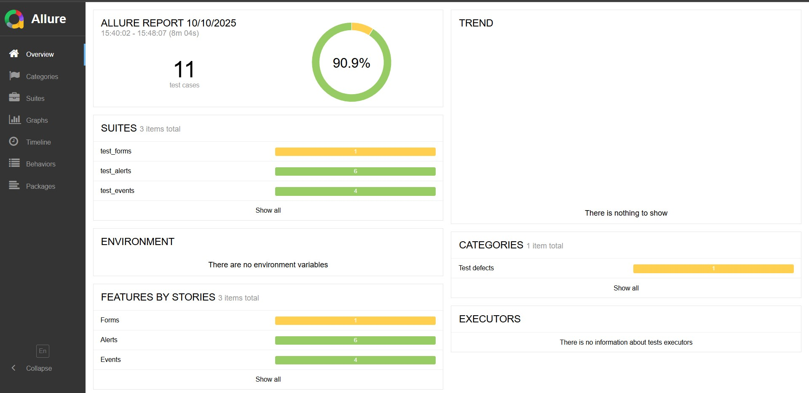
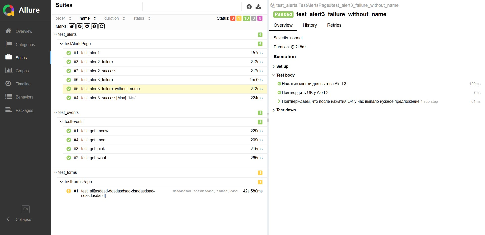
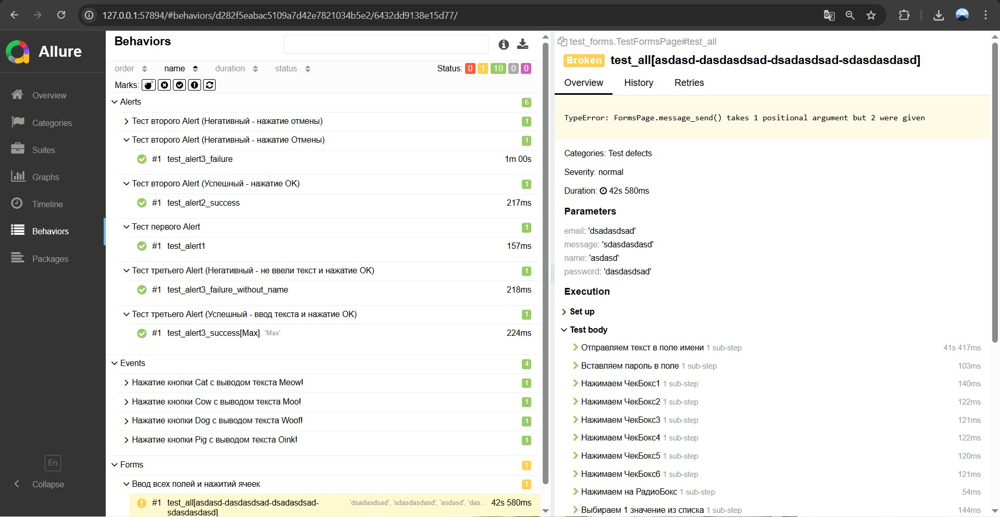
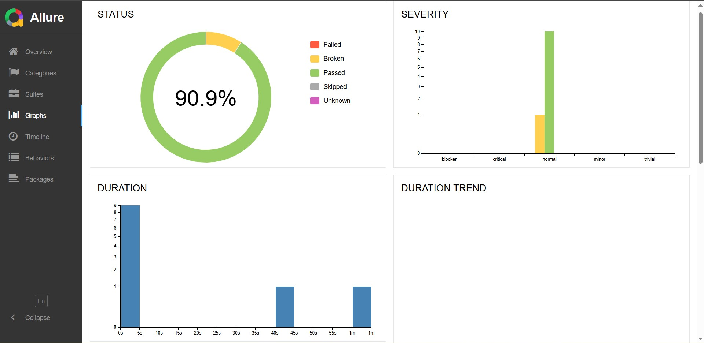

# VolgaIT_QA_SemiFinal
<h2>Тест-кейс №1 - Формы</h2>
<h3>Заполнение всех полей формы - Тест 1</h3>
<strong>Предусловия:</strong> Открыта страница [формы](https://practice-automation.com/form-fields/) 
<strong>Шаги</strong>
<ul>
  <li>Заполнить поле "Name"</li>
  <li>Заполнить поле "Password"</li>
  <li>Нажать на все ячейки</li>
  <li>Нажать на радиокнопку "Yellow"</li>
  <li>Нажать на список с текстом "Do you like automation?"</li>
  <li>Нажать на любую ячейку из списка</li>
  <li>Заполнить поле "Email"</li>
  <li>Записать на поле "Message" самый длинный текст из предложенных</li>
  <li>Нажать на кнопку "Submit"</li>
</ul>
<strong>Ожидаемый результат</strong> - Появление окна сообщения Alert с текстом "Message received!"

<h2>Тест-кейс №2 - События</h2>
<h3>Получение текста кота - Тест 1</h3>
<strong>Предусловия:</strong> Открыта страница [событий](https://practice-automation.com/click-events/) 
<strong>Шаги</strong>
<ul>
  <li>Нажать на кнопку "Cat"</li>
</ul>
<strong>Ожидаемый результат</strong> - Появление текста "Meow!"

<h3>Получение текста собаки - Тест 2</h3>
<strong>Предусловия:</strong> Открыта страница [событий](https://practice-automation.com/click-events/) 
<strong>Шаги</strong>
<ul>
  <li>Нажать на кнопку "Dog"</li>
</ul>
<strong>Ожидаемый результат</strong> - Появление текста "Woof!"

<h3>Получение текста свинки - Тест 3</h3>
<strong>Предусловия:</strong> Открыта страница [событий](https://practice-automation.com/click-events/) 
<strong>Шаги</strong>
<ul>
  <li>Нажать на кнопку "Pig"</li>
</ul>
<strong>Ожидаемый результат</strong> - Появление текста "Oink!"

<h3>Получение текста кота - Тест 4</h3>
<strong>Предусловия:</strong> Открыта страница [событий](https://practice-automation.com/click-events/) 
<strong>Шаги</strong>
<ul>
  <li>Нажать на кнопку "Сow"</li>
</ul>
<strong>Ожидаемый результат</strong> - Появление текста "Moo!"

<h2>Тест-кейс №3 - Модальные окна</h2>
<h3>Вывод модального окна №1 - Тест 1</h3>
<strong>Предусловия:</strong> Открыта страница [модальных окон](https://practice-automation.com/popups/) 
<strong>Шаги</strong>
<ul>
  <li>Нажать на кнопку "Alert Popup"</li>
</ul>
<strong>Ожидаемый результат</strong> - Появление текста в модальном окне - "Hi there, pal!"

<h3>Вывод модального окна №2 - Тест 2</h3>
<strong>Предусловия:</strong> Открыта страница [модальных окон](https://practice-automation.com/popups/) 
<strong>Шаги</strong>
<ul>
  <li>Нажать на кнопку "Confirm Popup"</li>
  <li>Нажать на кнопку "ОК" в модальном окне</li>
</ul>
<strong>Ожидаемый результат</strong> - Появление текста - "OK it is!"

<h3>Вывод модального окна №2 - Тест 3</h3>
<strong>Предусловия:</strong> Открыта страница [модальных окон](https://practice-automation.com/popups/) 
<strong>Шаги</strong>
<ul>
  <li>Нажать на кнопку "Confirm Popup"</li>
  <li>Нажать на кнопку "Cancel" в модальном окне</li>
</ul>
<strong>Ожидаемый результат</strong> - Появление текста - "Cancel it is!"

<h3>Вывод модального окна №3 - Тест 4</h3>
<strong>Предусловия:</strong> Открыта страница [модальных окон](https://practice-automation.com/popups/) 
<strong>Шаги</strong>
<ul>
  <li>Нажать на кнопку "Prompt Popup"</li>
  <li>Ввести текст в модальном окне</li>
  <li>Нажать на кнопку "ОК" в модальном окне</li>
</ul>
<strong>Ожидаемый результат</strong> - Появление текста - "Nice to meet you, {Введенным текст}"

<h3>Вывод модального окна №3 - Тест 5</h3>
<strong>Предусловия:</strong> Открыта страница [модальных окон](https://practice-automation.com/popups/) 
<strong>Шаги</strong>
<ul>
  <li>Нажать на кнопку "Prompt Popup"</li>
  <li>Нажать на кнопку "ОК" в модальном окне</li>
</ul>
<strong>Ожидаемый результат</strong> - Появление текста - "Fine, be that way..."

<h3>Вывод модального окна №3 - Тест 6</h3>
<strong>Предусловия:</strong> Открыта страница [модальных окон](https://practice-automation.com/popups/) 
<strong>Шаги</strong>
<ul>
  <li>Нажать на кнопку "Prompt Popup"</li>
  <li>Нажать на кнопку "Cancel" в модальном окне</li>
</ul>
<strong>Ожидаемый результат</strong> - Появление текста - "Fine, be that way..."

<h2>Отчеты на Allure</h2>

  
  
  
  

<h2>Установка и запуск</h2>
<ol>
    <li>Клонировать репозиторий</li>
    <li>Установить зависимости: <code>pip install -r requirements.txt</code></li>
    <li>Настроить переменные окружения в <code>.env</code></li>
    <li>Запустить тесты с нужными вам параметрами: <code>pytest -v -s</code> - это выдаст подробное описание тестов и все print</li>
    <li>Запустить параллельные тесты: <code>pytest -n auto</code></li>
    <li>Если вам нужен конректные тесты (Поиск элементов, Положительные или Негативные тесты), то запускайте так - <code>cd tests</code>, потом <code>pytest *Название файла*</code></li>
    <li>Если вам нужен тест какой-то из тест-кейса (функцию), то запускайте так - <code>cd tests</code>, потом <code>pytest *Название файла*::*Название функции*</code></li>
    <li>Если сайт из allure-report не открывается, можете локально запустить свой - <code>allure serve results</code></li>
</ol>
